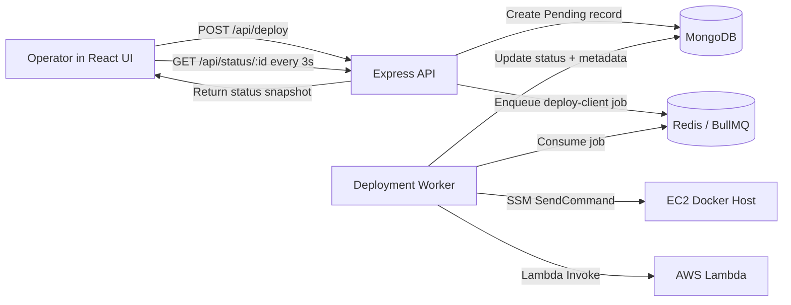

# Hosting Control Panel Demo

Full-stack deployment control panel for onboarding clients and running containerized deployments with asynchronous job processing.

Stack: React + Vite, Express, MongoDB, Redis (BullMQ), AWS SSM, and AWS Lambda.


## What This Project Does

This project lets an operator submit a client deployment request from a web UI.
The backend saves the request, queues a background job, and processes deployment steps on AWS:

- Runs Docker deployment commands on an EC2 instance using AWS SSM.
- Triggers a post-deployment AWS Lambda function.
- Tracks status in MongoDB and exposes real-time progress to the UI.

## High-Level Flow

1. User submits onboarding form in the React app.
2. API validates payload and writes a deployment document with `Pending` status.
3. API adds a BullMQ job to Redis.
4. Worker consumes the job, then:
5. Sends remote Docker commands to EC2 via `SendCommand`.
6. Invokes Lambda for post-deployment setup via `InvokeCommand`.
7. Updates deployment as `Completed` or `Failed`.
8. Frontend polls every 3 seconds and displays live status.

## Architecture Diagram



Provided flow chart (Excalidraw):

- https://excalidraw.com/#json=QcsI9AshKNE722RiQWn9E,aw0O4nijoca50cg85v1vcA

## Repository Structure

```text
.
├── backend/                # Express API + BullMQ worker
│   ├── src/index.js        # API server entrypoint
│   ├── src/worker.js       # Worker entrypoint
│   ├── src/routes/         # API routes
│   ├── src/models/         # Mongoose models
│   ├── src/queue/          # BullMQ queue + Redis connection
│   └── src/services/       # AWS deployment executors
├── frontend/               # React + Vite control panel
└── docker-compose.yml      # Local MongoDB + Redis
```

## Local Prerequisites

- Node.js 20+
- npm 10+
- Docker Desktop (or Docker Engine)
- AWS credentials available in your shell/profile if you want real AWS execution

## Environment Configuration

### Backend Environment

Create `backend/.env` from `backend/.env.example`:

```bash
cd backend
cp .env.example .env
```

Variables:

- `PORT` API port (default `4000`)
- `MONGODB_URI` Mongo connection string (default `mongodb://localhost:27017/control-panel`)
- `REDIS_URL` Redis connection string (default `redis://127.0.0.1:6379`)
- `AWS_REGION` AWS region for SSM and Lambda clients (default `us-east-1`)
- `EC2_INSTANCE_ID` target EC2 for deployment command
- `LAMBDA_FUNCTION_NAME` post-deployment lambda name

Notes:

- If using Upstash or TLS Redis, use a `rediss://` URL.
- The worker auto-enables TLS when protocol is `rediss:`.

### Frontend Environment

The app uses:

- `VITE_API_BASE_URL` (optional, defaults to `http://localhost:4000`)

Example `frontend/.env`:

```bash
VITE_API_BASE_URL=http://localhost:4000
```

## Run Locally (Step-by-Step)

### 1. Start infrastructure

From repository root:

```bash
docker compose up -d
```

This starts:

- MongoDB on `27017`
- Redis on `6379`

### 2. Install dependencies

Backend:

```bash
cd backend
npm install
```

Frontend:

```bash
cd ../frontend
npm install
```

### 3. Start backend API

In terminal 1:

```bash
cd backend
npm run dev
```

Expected log:

- `API listening on port 4000`

### 4. Start worker

In terminal 2:

```bash
cd backend
npm run worker:dev
```

Expected logs include:

- `Deployment worker started`
- `Redis: connected`

### 5. Start frontend

In terminal 3:

```bash
cd frontend
npm run dev
```

Open the Vite URL shown in terminal (usually `http://localhost:5173`).

## How It Works Internally

### API layer

- `POST /api/deploy` validates `clientName`, `domain`, and `image`.
- Creates a deployment record with `Pending` status.
- Enqueues BullMQ job `deploy-client` with retry/backoff policy.
- Returns `{ id, status }` immediately.

### Queue and worker layer

- Worker reads jobs from `deployment-jobs` queue.
- For each job, it:
  - Sends Docker commands to EC2 via SSM.
  - Invokes Lambda for post-deployment tasks.
  - Writes metadata and final status back to MongoDB.

Job config:

- Attempts: `2`
- Backoff: exponential, starting at `5000ms`
- Concurrency: `2`

### Deployment command strategy

Worker computes a safe container name and executes:

1. `docker pull <image>`
2. `docker rm -f <container> || true`
3. `docker run -d --restart unless-stopped --name <container> -e VIRTUAL_HOST=<domain> <image>`

## API Reference

### Health Check

`GET /health`

Response:

```json
{
  "ok": true
}
```

### Create Deployment

`POST /api/deploy`

Request body:

```json
{
  "clientName": "Acme Corp",
  "domain": "test.ourplatform.com",
  "image": "nginx:latest"
}
```

Success response:

```json
{
  "id": "6652f...",
  "status": "Pending"
}
```

Validation error example:

```json
{
  "message": "Invalid payload",
  "errors": ["clientName is required"]
}
```

### Check Deployment Status

`GET /api/status/:id`

Success response includes:

- `id`
- `clientName`
- `domain`
- `image`
- `status` (`Pending | Completed | Failed`)
- `errorMessage`
- `metadata`
- `createdAt`
- `updatedAt`

## Quick Manual Test (curl)

```bash
curl -X POST http://localhost:4000/api/deploy \
  -H "Content-Type: application/json" \
  -d '{"clientName":"Acme Corp","domain":"test.ourplatform.com","image":"nginx:latest"}'
```

Use returned `id`:

```bash
curl http://localhost:4000/api/status/<deployment-id>
```

## Troubleshooting

### API fails on startup

- Verify MongoDB is running: `docker ps`
- Verify `MONGODB_URI` in `backend/.env`

### Worker cannot connect to Redis

- Confirm Redis container is healthy
- Check `REDIS_URL`
- For managed Redis/Upstash, switch to `rediss://...`

### Deployment reaches Failed status

- Inspect worker logs for AWS or Docker command errors
- Validate `EC2_INSTANCE_ID` and `LAMBDA_FUNCTION_NAME`
- Verify IAM permissions for `ssm:SendCommand` and `lambda:InvokeFunction`

## Current Limitations and Production Notes

- No authentication or RBAC on API routes
- No rate limiting
- No polling of SSM command final execution state (`GetCommandInvocation`)
- Minimal input validation (string presence only)

Recommended hardening:

- Add auth + role checks
- Add schema validation (Joi/Zod)
- Add observability (structured logs, tracing)
- Add retry and dead-letter strategy tuning
